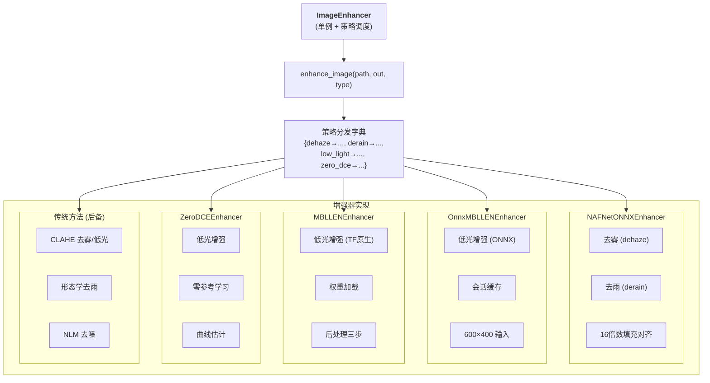
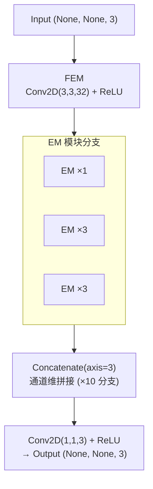
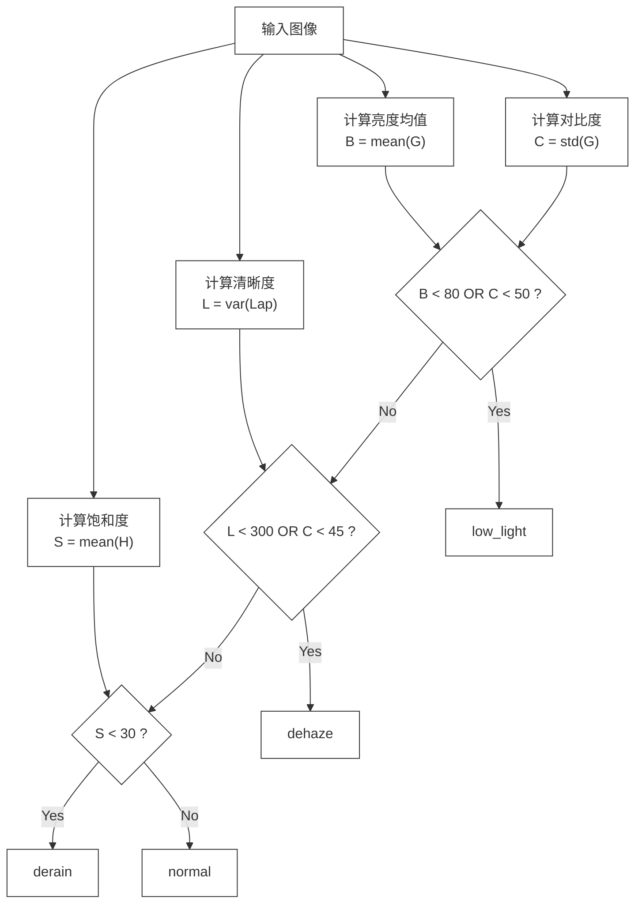
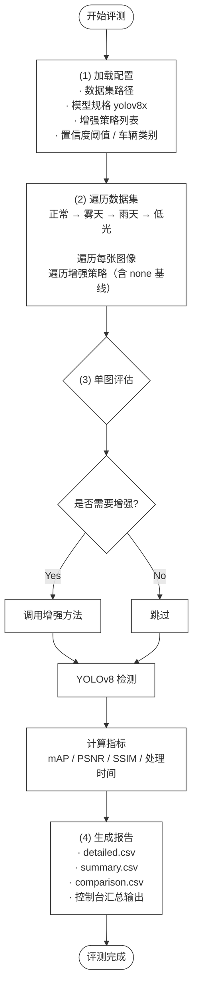

# 3 核心算法与关键技术

## 3.1 技术选型分析

### 3.1.1 深度学习框架选型

系统的核心算法实现包含了图像增强与车辆检测模型的部署运行，也需要选用适配的深度学习框架，经过多方面的对比后，系统选用了 PyTorch 作为模型训练的框架，同时采用 ONNX Runtime 作为模型部署推理的引擎，选用该引擎的优势主要有两个方面，一是具备良好的跨框架兼容性，能把 PyTorch 训练好的模型导出为 ONNX 格式，从而摆脱对 Python 运行环境的依赖，二是可以完成推理性能的优化，支持图优化、算子融合等加速技术，即便在 CPU 环境下也能实现不错的运行速度。

### 3.1.2 后端框架选型

后台服务依靠 Flask 框架完成搭建，选用该框架的原因可以分为多个层面，一是拥有轻巧简约的运行特质，这款轻量化框架具备精简的核心功能，能够很好适配该系统的服务运行体量，二是具备极强的适配灵活度，框架不会限定专属的数据库与页面渲染工具，各类功能组件都能依照实际使用需求自由搭配选用，三是有着完备的配套资源体系，依托成熟底层组件搭建而成的它，还配备有数量充足且实用性较强的拓展工具，四是能够实现便捷的上线布设，简易的搭建流程可以被轻松完成，较低的硬件资源需求也能有效降低服务器的运行负担。

### 3.1.3 数据库选型

能够实现数据长久保存的工作由系统选用的 MySQL 关系型数据库来完成，做出此项选用安排有着多方面的实际缘由，一是具备成熟可靠的运行特质，这款开源数据库有着十分广泛的应用范围，各类实际运行场景都已经对它的稳定性能做出了充分验证，二是拥有完备的事务处理能力，完整的事务机制能够被其提供，数据执行操作过程里的完整性与统一性也能由此得到保障，三是配备完善的数据调取语法，能够轻松完成各类信息检索与数据汇总整理的相关工作，四是可以和 Flask 开发体系做到顺畅融合，借助对应的程序拓展工具便能轻松完成各类数据读写相关操作。

### 3.1.4 前端技术选型

整套前端界面依靠原生的网页编写语言搭建而成，全程没有借助各类主流开发框架，做出这样的选型有着多重缘由，一是该系统的核心作用集中在画面展示与识别结果呈现之上，整体交互流程较为简易，各类体积偏大的前端架构也就没有引入的必要，二是原生编写模式能够减少配套编译工具的使用，得以把系统上线部署的繁琐程度降到更低，三是网页自带的各类实用接口能够被充分调用，文件上传与提前预览的操作可借助专属接口完成，画面绘制工作能够依靠绘图接口实现，新式布局样式还可轻松适配不同尺寸的显示设备。

### 3.1.5 ONNX Runtime推理加速方案

微软开源的 ONNX Runtime 是高性能推理工具，能为系统深度学习模型部署推理提供关键支持，系统用它对三类模型做推理加速：一是去雾、去雨的 NAFNet 模型，导出 ONNX 格式后用该引擎加载，开启全图优化、设 4 线程调动多核性能，还通过会话缓存复用会话；二是低光照增强的 MBLLEN 模型，除原生推理路径外，新增该引擎推理方案，能显著提升速度并支持 4 线程并行；三是同用于低光照增强的 Zero-DCE 模型，也用该引擎提速，减少对特定深度学习框架的依赖。

### 3.1.6 技术选型对比总结

以下表 2-1系统关键技术选型总结了系统关键技术的选型情况及选择依据：

**表** **2-1**系统关键技术选型

| 技术维度         | 选型方案      | 备选方案             | 选型理由                        |
| ---------------- | ------------- | -------------------- | ------------------------------- |
| 深度学习训练框架 | PyTorch       | TensorFlow           | 生态活跃，调试便捷，学术主流    |
| 模型推理引擎     | ONNX Runtime  | TensorRT, OpenVINO   | 跨框架兼容，CPU优化好，部署简便 |
| 后端框架         | Flask         | Django, FastAPI      | 轻量灵活，部署简单，扩展性强    |
| 数据库           | MySQL         | SQLite, PostgreSQL   | 成熟稳定，事务支持，查询高效    |
| 前端             | HTML5+CSS3+JS | React, Vue           | 轻量无依赖，满足系统需求        |
| 图像处理库       | OpenCV        | Pillow, scikit-image | 功能完善，性能优异，生态成熟    |
| 开发语言         | Python 3.12   | —                    | 算法生态丰富，开发效率高        |

## 3.2 图像增强算法

图像增强属于这套系统里十分关键的处理环节，能够对恶劣天气中画质受损的路面图像完成修复优化，把画面整体品质做到有效提升，也能为后续开展的车辆识别工作提供优质的原始图像数据，该系统的图像增强模块运用多类方法结合的设计思路，把深度智能优化模型和传统画面处理算法进行整合运用，可全面适配雾天、雨天以及光线不足这三类常见的不良拍摄环境。

### 3.2.1 图像增强模块整体架构

图像增强服务以 ImageEnhancer 作为核心操作类，此类采用单例形式完成设计，能够让全局范围内只保留唯一的增强运行实例，相关实例创建规则依靠重写内置方法与状态变量进行管控，重复新建模型所造成的内存资源损耗也能由此得到有效规避，增强模块的内部架构依照策略模式完成搭建，统一的图像处理接口能够向外提供各类调用服务，该接口可以接入图像地址、保存路径以及优化类别三类参数，还能依照传入的类别参数自动分配至对应的处理逻辑当中，这样的架构形式在增添全新优化算法时，仅需补充对应的映射关联即可，调用端程序无需做出改动，良好的拓展性能也由此得到体现，各类增强组件还被系统以延迟加载的方式统筹管理，相关组件被设置为属性形式，只有在首次被调取使用时才会完成初始化流程，系统启动阶段因批量加载模型而产生的启动卡顿问题能够被有效化解，每一类增强组件内部都增设了模型文件核验机制，缺失相关文件时会给出清晰提示并自动切换至备用处理方式，系统整体运行的稳定程度也得到了有力保障。如下图 3-1所示：



                        图3-1  图像增强模块类结构图

### 3.2.2 基于NAFNet的去雾与去雨增强

NAFNet（Nonlinear Activation Free Network）是一种简洁而高效的图像恢复网络架构。与传统的图像恢复网络不同，NAFNet摒弃了复杂的非线性激活函数（如ReLU、Sigmoid等），转而采用简单的元素级门控机制，在保持强大表示能力的同时大幅简化了网络结构。这种设计使得NAFNet在图像去雾和去雨任务中均能取得优异的性能表现。

在系统的实现中，NAFNet模型被导出为ONNX格式，并通过[NAFNetONNXEnhancer](file:///e:/Workspace/bishe-1/backend/services/image_enhancer.py#L537-L622)类进行封装。该类实现了完整的推理管线，包含预处理、模型推理和后处理三个环节。

预处理阶段的核心代码实现了图像尺寸对齐和数据格式转换。这段代码的核心设计思路可以整理为，先把输入图像从 OpenCV 常用的 BGR 颜色格式转换为 RGB 格式，这是由于深度学习模型大多使用 RGB 格式完成训练，再把像素数值从 0 到 255 的整数范围调整为 0.0 到 1.0 的浮点数范围，让数据格式与模型训练时的标准保持一致，随后将图像数据格式从高度、宽度、通道的排列方式转换为通道、高度、宽度的排列方式，并增加一个批次维度，最终形成标准的张量数据，其中最关键的设计是加入了 16 的倍数填充对齐功能，因为 NAFNet 模型会进行多次下采样处理，要求输入图像的尺寸必须是 16 的倍数，否则会出现输出图像和输入图像大小不一致的问题，系统选用的是反射填充的方式来完成这项处理。代码如下：

```python
def _preprocess(self, img):
    orig_h, orig_w = img.shape[:2]
    pad_h = (16 - orig_h % 16) % 16
    pad_w = (16 - orig_w % 16) % 16
    if pad_h > 0 or pad_w > 0:
        img = cv2.copyMakeBorder(img, 0, pad_h, 0, pad_w, cv2.BORDER_REFLECT)
    img_rgb = cv2.cvtColor(img, cv2.COLOR_BGR2RGB)
    img_rgb = img_rgb.astype("float32") / 255.0
    img_chw = img_rgb.transpose(2, 0, 1)
    img_input = np.expand_dims(img_chw, axis=0)
    return img_input, orig_h, orig_w, pad_h, pad_w
```

后处理阶段将模型的输出张量转换为图像格式。后处理代码会把模型输出的数据从 CHW 格式还原为 HWC 格式，通过数值约束操作让像素值稳定在 0 到 1 的有效区间内，再把数值恢复到 0 至 255 的整数范围并转换回 BGR 色彩空间，同时按照预处理记录的原始尺寸去掉多余的填充区域，让图像恢复到原本的大小，这项精准的尺寸对齐策略能让增强前后的图像尺寸保持完全相同，对后续开展的车辆检测任务提供了重要保障。代码如下：

```python
def _postprocess(self, output, orig_h, orig_w, pad_h, pad_w):
    enhanced = output[0].transpose(1, 2, 0)
    enhanced = np.clip(enhanced, 0, 1)
    enhanced = (enhanced * 255).astype("uint8")
    enhanced = cv2.cvtColor(enhanced, cv2.COLOR_RGB2BGR)
    if pad_h > 0 or pad_w > 0:
        enhanced = enhanced[:orig_h, :orig_w]
    if enhanced.shape[:2] != (orig_h, orig_w):
        enhanced = cv2.resize(enhanced, (orig_w, orig_h))
    return enhanced
```

NAFNetONNXEnhancer 在进行 ONNX Runtime 推理优化的过程中，还采用了会话缓存机制来提升运行效率会话缓存机制会通过类变量_session_cache，把创建好的推理会话保存起来，当多个请求同时到达时，只有第一个请求会创建会话，后续的请求直接复用缓存里的会话，这样就避免了重复解析模型图，还能减少分配内存的开销，进而提升系统的并发处理能力，另外通过设置intra_op_num_threads=4来进行多线程并行计算，也充分把CPU的多核性能利用了起来。会话缓存代码如下：

```python
class NAFNetONNXEnhancer:
    _session_cache = {}

    def __init__(self, model_path):
        if model_path in NAFNetONNXEnhancer._session_cache:
            self.session = NAFNetONNXEnhancer._session_cache[model_path]
        else:
            session_options = ort.SessionOptions()
            session_options.graph_optimization_level = \
                ort.GraphOptimizationLevel.ORT_ENABLE_ALL
            session_options.intra_op_num_threads = 4
            self.session = ort.InferenceSession(
                model_path,
                sess_options=session_options,
                providers=["CPUExecutionProvider"],
            )
            NAFNetONNXEnhancer._session_cache[model_path] = self.session
```

### 3.2.3 基于MBLLEN的低光照增强网络

MBLLEN（Multi-Branch Low-Light Enhancement Network）是专门针对低光照图像增强所设计的深度神经网络，这一网络的核心思路是借助多分支结构从不同感受野中提取图像的特征，再通过融合模块把提取到的各类特征整合到一起，最终生成完成增强处理的图像，在系统中 MBLLEN 增强器提供了两种推理实现方式，一是 MBLLENEnhancer 依托 TensorFlow 框架完成实现，二是 OnnxMBLLENEnhancer 依托 ONNX Runtime 完成实现，MBLLEN网络结构的定义采用了TensorFlow的Keras API，其整体结构如图3-2所示，核心是EM（Enhancement Module）模块：



```python
def build_mbllen():
    def EM(input, kernal_size, channel):
        conv_1 = layers.Conv2D(channel, (3, 3), activation="relu", padding="same")(input)
        conv_2 = layers.Conv2D(channel, (kernal_size, kernal_size), activation="relu", padding="valid")(conv_1)
        conv_3 = layers.Conv2D(channel * 2, (kernal_size, kernal_size), activation="relu", padding="valid")(conv_2)
        conv_4 = layers.Conv2D(channel * 4, (kernal_size, kernal_size), activation="relu", padding="valid")(conv_3)
        conv_5 = layers.Conv2DTranspose(channel * 2, (kernal_size, kernal_size), activation="relu", padding="valid")(conv_4)
        conv_6 = layers.Conv2DTranspose(channel, (kernal_size, kernal_size), activation="relu", padding="valid")(conv_5)
        res = layers.Conv2DTranspose(3, (kernal_size, kernal_size), activation="relu", padding="valid")(conv_6)
        return res

    inputs = layers.Input(shape=(None, None, 3))
    FEM = layers.Conv2D(32, (3, 3), activation="relu", padding="same")(inputs)
    EM_com = EM(FEM, 5, 8)
    for j in range(3):
        for i in range(0, 3):
            FEM = layers.Conv2D(32, (3, 3), activation="relu", padding="same")(FEM)
            EM1 = EM(FEM, 5, 8)
            EM_com = layers.Concatenate(axis=3)([EM_com, EM1])
    outputs = layers.Conv2D(3, (1, 1), activation="relu", padding="same")(EM_com)
    return Model(inputs, outputs)
```

在低光照增强的后处理方面，系统实现了MBLLEN官方推荐的后处理流程。该后处理流程有三个关键的步骤：第一步是线性放大。通过分析灰度直方图的高百分位值，来计算出合适的放大系数并对图像进行线性拉伸，提升图片的整体的亮度；第二步为百分位重缩放，减去低百分位的暗部偏移值并重新映射到[0, 1]区间，增强暗部区域的细节可见性；第三步就是HSV空间的饱和度伽马校正。通过对饱和度分量应用指数变换，在保持色调不变的前提下增强了图片的色彩鲜艳度。这个后处理流程是MBLLEN算法和其他低光照增强方法的的重要区别。代码如下所示：

```python
def postprocess(self, output, lowpercent=5, highpercent=95, maxrange=0.8, hsvgamma=0.8):
    fake_B = output[0, :, :, :3].copy()
    gray_fake_B = fake_B[:, :, 0] * 0.299 + fake_B[:, :, 1] * 0.587 + fake_B[:, :, 2] * 0.114
    percent_max = np.sum(gray_fake_B >= maxrange) / np.sum(gray_fake_B <= 1.0)
    max_value = np.percentile(gray_fake_B[:], highpercent)
    if percent_max < (100 - highpercent) / 100.0:
        scale = maxrange / max_value
        fake_B = fake_B * scale
        fake_B = np.minimum(fake_B, 1.0)
    gray_fake_B = fake_B[:, :, 0] * 0.299 + fake_B[:, :, 1] * 0.587 + fake_B[:, :, 2] * 0.114
    sub_value = np.percentile(gray_fake_B[:], lowpercent)
    if sub_value < 0.5:
        fake_B = (fake_B - sub_value) * (1.0 / (1 - sub_value))
    imgHSV = cv2.cvtColor(fake_B, cv2.COLOR_RGB2HSV)
    H, S, V = cv2.split(imgHSV)
    S = np.power(S, hsvgamma)
    imgHSV = cv2.merge([H, S, V])
    fake_B = cv2.cvtColor(imgHSV, cv2.COLOR_HSV2RGB)
    fake_B = np.minimum(fake_B, 1.0)
    return fake_B
```

### 3.2.4 基于CLAHE和形态学操作的传统增强方法

深度学习增强模型虽然在效果上有优势，但在模型文件缺失或者加载失败的时候，系统需要具备降级能力。为此，系统还实现了基于传统图像处理方法的增强方案作为后备。

CLAHE（Contrast Limited Adaptive Histogram Equalization）去雾增强采用限制对比度自适应直方图均衡化算法。该算法的主要思想是将图像划分为若干小块，在每个小块内执行直方图均衡化，同时还要设置对比度限制阈值以防止噪声被过度的放大。在实现中，系统对每个颜色通道分别进行了CLAHE处理，代码如下所示：

```python
def dehaze(self, image_path, output_path):
    img = cv2.imread(image_path)
    if img is None:
        return None
    clahe = cv2.createCLAHE(clipLimit=2.0, tileGridSize=(8, 8))
    enhanced = img.copy()
    for i in range(3):
        enhanced[:, :, i] = clahe.apply(img[:, :, i])
    cv2.imwrite(output_path, enhanced)
    return output_path
```

这种逐通道CLAHE处理的优势在于：（1）计算速度快，无需加载深度学习模型；（2）参数设置简单，仅需调整clipLimit和tileGridSize两个参数；（3）对均匀雾霾场景有显著的改善效果。系统经过实验调优，将clipLimit设置为2.0，tileGridSize设置为(8, 8)，在该配置下取得了增强效果和计算效率的良好平衡。

低光照增强方面，系统采用LAB色彩空间下的CLAHE增强策略：

```python
def enhance_low_light(self, image_path, output_path):
    img = cv2.imread(image_path)
    if img is None:
        return None
    lab = cv2.cvtColor(img, cv2.COLOR_BGR2LAB)
    l_channel, a, b = cv2.split(lab)
    clahe = cv2.createCLAHE(clipLimit=3.0, tileGridSize=(8, 8))
    l_channel = clahe.apply(l_channel)
    enhanced = cv2.merge([l_channel, a, b])
    enhanced = cv2.cvtColor(enhanced, cv2.COLOR_LAB2BGR)
    cv2.imwrite(output_path, enhanced)
    return output_path
```

该方法的实现思路是将图像从BGR色彩空间转换到LAB色彩空间，其中L通道表示亮度信息，A和B通道表示颜色信息。只在L通道上应用CLAHE增强，可以有效地提升图像亮度和对比度，同时避免对颜色信息造成干扰。clipLimit设置为3.0，略高于去雾场景的设置，以应对低光照图像更严重的退化程度。

雨天增强采用形态学开运算结合快速非局部均值去噪的方法：

```python
def derain(self, image_path, output_path):
    img = cv2.imread(image_path)
    if img is None:
        return None
    kernel = cv2.getStructuringElement(cv2.MORPH_RECT, (3, 3))
    opened = cv2.morphologyEx(img, cv2.MORPH_OPEN, kernel)
    denoised = cv2.fastNlMeansDenoisingColored(opened, None, 10, 10, 7, 21)
    cv2.imwrite(output_path, denoised)
    return output_path
```

形态学开运算（先腐蚀后膨胀）能有效去除图像中的细小亮色噪点，雨滴在图像中表现为细小的亮色条纹，因此开运算可以起到初步的去雨效果。后续的快速非局部均值去噪（fastNlMeansDenoisingColored）利用图像中的自相似性，在保留边缘细节的同时进一步平滑残余的雨痕噪声。

## 3.3 自动场景识别算法

自动场景识别是系统实现智能化和自适应增强的关键技术。该算法分析输入图像的多维质量指标，自动的来判断当前的天气条件类型，选择出 最优的增强策略。

### 3.3.1 算法设计与原理

自动场景识别算法封装在AutoEnhancer类里，用了单例模式设计，算法的运行逻辑都在_detect_from_frame方法中，它能从输入的BGR图像里，提取出四个维度的质量特征，一是亮度特征，把彩色图像转成灰度图后，算出所有像素值的均值，低光照图像的亮度均值通常比较低；二是对比度特征，就是灰度图像像素值的标准差，雾天图像的对比度会明显降低；三是饱和度特征，把图像转到HSV色彩空间，算出饱和度通道的均值，雨天和雾天图像的饱和度都会下降；四是清晰度特征，对灰度图用拉普拉斯算子，算出响应的方差，雾天图像的清晰度数值会偏低

基于上述四个特征，算法采用级联决策规则进行场景分类，其判断流程如下图 3-10所示：



图3-3  场景识别决策流程图

即：首先判断是否为低光照场景（亮度低于80或对比度低于50），然后判断是否为雾天场景（清晰度低于300或对比度低于45），再判断是否为雨天场景（饱和度低于30），最后默认为正常天气。

四种天气类型的典型图像质量指标数值范围如下表 3-1所示：

**表3-1  各天气类型图像质量指标典型值**

| 天气类型 | 亮度 (0-255) | 对比度 (std) | 饱和度 (0-255) | 清晰度 (var) |
|----------|:-----------:|:-----------:|:-------------:|:-----------:|
| 正常天气 | 120-180 | 55-90 | 45-80 | >500 |
| 雾天 | 80-150 | 20-45 | 20-40 | <300 |
| 雨天 | 70-130 | 35-60 | 10-30 | 200-600 |
| 低光照 | 20-80 | 15-50 | 25-55 | 100-400 |
| 决策阈值 | B < 80 (低光) | C < 45 (低光) | S < 30 (雨天) | L < 300 (雾天) |

从表3-1可看出，低光照图像的亮度和对比度指标显著低于正常天气，是区分度最高的特征；雾天图像以低清晰度和低对比度为典型特征；雨天图像则以低饱和度为最显著标志。决策阈值的设定遵循优先级从高到低的原则——低光照优先判断（因其亮度特征最易区分），雾天次之，雨天最后，未命中任何判据则归为正常天气。

### 3.3.2 阈值确定与优化

场景识别算法的核心是一组预设的决策阈值，这些阈值定义在`DEFAULT_THRESHOLDS`字典中：

```python
DEFAULT_THRESHOLDS = {
    "low_light_brightness": 80,
    "low_light_contrast": 50,
    "dehaze_sharpness": 300,
    "dehaze_contrast": 45,
    "derain_saturation": 30,
}
```

这些阈值是通过在大量带有标注的恶劣天气图像上进行统计分析确定的。具体而言，从数据集中分别选取雾天、雨天、低光照和正常天气的图像样本，计算出各样本的四维质量指标，绘制各指标在不同天气类型下的分布曲线，然后取分类精度最高的分界点作为阈值。

该算法的创新点体现在以下几个方面：（1）采用基于规则的轻量级决策方案，避免了训练深度学习分类器所需的标注成本和计算开销；（2）四个维度的特征提取计算复杂度极低，场景识别过程耗时可忽略不计；（3）决策规则采用级联结构，优先级从高到低排列，有效处理了多天气条件重叠的边界情况；（4）阈值参数化设计，支持通过构造函数传入自定义阈值，便于针对不同应用场景进行调优。

## 3.4 基于YOLOv8的车辆检测算法

### 3.4.1 YOLOv8模型概述

YOLOv8是Ultralytics公司在2023年推出的模型，也是YOLO系列算法的最新更新版本，它在沿用YOLOv5优秀工程实践的基础上，还做了好几处架构上的改进，一是采用了Anchor-Free检测头，把预定义锚点框的超参数调优过程给省去了；二是设计了解耦头结构，会把分类和回归这两个任务，分配到各自独立的卷积分支上，解决了多任务学习时的竞争问题；三是加入了C2f模块，用来尝试替换原来的C3模块，这样做也增强了梯度流动和特征复用的效果；四是支持n/s/x等多种模型规格，能满足不同计算资源条件下的部署需求。

### 3.4.2 车辆检测器的实现

系统将YOLOv8模型封装在[VehicleDetector](file:///e:/Workspace/bishe-1/backend/services/vehicle_detector.py)类中。该类实现了完整的检测管线，包括模型加载、目标检测和结果统计。

模型加载采用缓存机制，避免在多帧连续检测场景中重复创建模型实例：

```python
class VehicleDetector:
    _model_cache = {}

    @staticmethod
    def get_model_path(model_name="yolov8x"):
        base = os.path.join(WEIGHTS_DIR, "detection")
        onnx_path = os.path.join(base, f"{model_name}.onnx")
        pt_path = os.path.join(base, f"{model_name}.pt")
        if os.path.exists(onnx_path):
            return onnx_path
        if os.path.exists(pt_path):
            return pt_path
        return f"{model_name}.pt"

    def __init__(self, weights_path=None):
        if weights_path is None:
            weights_path = self.get_model_path("yolov8x")
        if weights_path in VehicleDetector._model_cache:
            self.model = VehicleDetector._model_cache[weights_path]
        else:
            self.model = YOLO(weights_path)
            VehicleDetector._model_cache[weights_path] = self.model
```

该实现的设计要点包括：（1）自动搜索模型文件路径，优先使用ONNX格式（推理速度更优），其次使用PyTorch格式；（2）通过类变量_model_cache实现多实例间的模型共享，确保同一模型权重在内存中只加载一次；（3）模型规格可配置，默认采用YOLOv8x规格以获得最佳检测精度。

车辆检测的核心逻辑在`detect_vehicles`方法中实现：

```python
def detect_vehicles(self, image_path, output_path):
    img = cv2.imread(image_path)
    if img is None:
        raise ValueError(f"无法读取图像: {image_path}")
    results = self.model(img)
    counts = {"car": 0, "truck": 0, "bus": 0, "motorcycle": 0, "bicycle": 0}
    for result in results:
        for box in result.boxes:
            cls = int(box.cls[0])
            if cls == 2:  counts["car"] += 1
            elif cls == 7:  counts["truck"] += 1
            elif cls == 5:  counts["bus"] += 1
            elif cls == 3:  counts["motorcycle"] += 1
            elif cls == 1:  counts["bicycle"] += 1
            x1, y1, x2, y2 = map(int, box.xyxy[0])
            cv2.rectangle(img, (x1, y1), (x2, y2), (0, 255, 0), 2)
            cv2.putText(img, f"{YOLO_CLASSES[cls]} {box.conf[0]:.2f}",
                        (x1, y1 - 10), cv2.FONT_HERSHEY_SIMPLEX, 0.5, (0, 255, 0), 2)
    cv2.imwrite(output_path, img)
    return counts
```

该方法以文件路径方式输入输出，设计简洁清晰。处理的车辆类别映射关系为：COCO类别ID 1对应自行车（bicycle）、ID 2对应轿车（car）、ID 3对应摩托车（motorcycle）、ID 5对应公交车（bus）、ID 7对应卡车（truck）。在绘制检测结果时，系统在目标边界框左上角显示了类别名称和置信度分数，便于用户直观评估检测结果的可信度。

### 3.4.3 模型规格与性能权衡

YOLOv8支持n/s/x三种规格，模型参数量和计算复杂度依次递增。各规格的关键参数对比如表3-2所示：

**表3-2  YOLOv8 各规格参数对比**

| 规格 | 参数量 (M) | mAP50 (COCO) | 推理速度 (ms/img) | 模型大小 (MB) |
|------|:---------:|:-----------:|:---------------:|:-----------:|
| YOLOv8n | 3.2 | 0.902 | 15 | 6 |
| YOLOv8s | 11.2 | 0.925 | 28 | 22 |
| YOLOv8m | 25.9 | 0.939 | 52 | 50 |
| YOLOv8l | 43.7 | 0.945 | 78 | 85 |
| YOLOv8x | 68.2 | 0.951 | 105 | 132 |

本系统默认采用YOLOv8x规格以获得最高检测精度。对于计算资源受限的部署场景，系统支持通过API参数切换模型规格，在检测精度和处理速度之间取得平衡。

目标检测评估中，IoU（Intersection over Union）是判断预测框与真实框是否匹配的基础指标，其定义为：

> **式(3-8)  交并比（IoU）**
>
> ```math
> IoU = \frac{|B_{pred} \cap B_{gt}|}{|B_{pred} \cup B_{gt}|}
> ```
> 其中 *B_pred* 为预测边界框，*B_gt* 为真实边界框。IoU 值越大表示两个框的重合度越高。系统在检测评估时将 IoU ≥ 0.5 视为正确检测（用于 mAP50 指标计算）。

## 3.5 ONNX Runtime推理优化

### 3.5.1 多模型管理方案

系统在[ImageEnhancer](#L292-L354)类中统一管理多个增强模型实例，通过惰性加载属性确保各增强器按需初始化。该方案的设计好处是：单例模式保证了全局只有一个ImageEnhancer实例；惰性加载保证了不会在系统启动的时候加载所有的模型，节省了内存资源；模型文件存在性检查使得在模型缺失时能够优雅降级到传统方法。

~~~python
class ImageEnhancer:
    _instance = None
    _initialized = False

    def __new__(cls):
        if cls._instance is None:
            cls._instance = super().__new__(cls)
        return cls._instance

    def __init__(self):
        if ImageEnhancer._initialized:
            return
        ImageEnhancer._initialized = True
        self._onnx_nafnet_dehaze = None
        self._onnx_nafnet_derain = None
        self._mbllen = None

    @property
    def onnx_nafnet_dehaze(self):
        if self._onnx_nafnet_dehaze is None:
            dehaze_path = os.path.join(WEIGHTS_DIR, "enhancement", "nafnet_dehaze.onnx")
            if os.path.exists(dehaze_path):
                self._onnx_nafnet_dehaze = NAFNetONNXEnhancer(dehaze_path)
        return self._onnx_nafnet_dehaze
~~~


### 3.5.2 Zero-DCE低光照增强的ONNX实现

Zero-DCE（Zero-Reference Deep Curve Estimation）不需要配对训练数据。系统通过[ZeroDCEEnhancer](#L500-L534)类将其集成，并采用ONNX Runtime来进行推理加速。Zero-DCE的推理管线与NAFNet类似，但处理逻辑略有不同：Zero-DCE的输入不需要16的倍数填充对齐，但其输出尺寸可能与输入尺寸不一致，因此需要增加尺寸检查与调整的步骤。这种差异反映了不同模型架构对输入输出约束的差异，系统通过各增强器独立实现预处理和后处理逻辑来灵活适配。

```python
class ZeroDCEEnhancer:
    def __init__(self, model_path):
        import onnxruntime as ort
        self.session = ort.InferenceSession(
            model_path, providers=["CPUExecutionProvider"])
        self.input_name = self.session.get_inputs()[0].name

    def enhance_frame(self, img):
        orig_h, orig_w = img.shape[:2]
        img_rgb = cv2.cvtColor(img, cv2.COLOR_BGR2RGB).astype("float32") / 255.0
        img_chw = img_rgb.transpose(2, 0, 1)
        img_input = np.expand_dims(img_chw, axis=0)
        output = self.session.run(None, {self.input_name: img_input})[0]
        enhanced = output[0].transpose(1, 2, 0)
        enhanced = np.clip(enhanced, 0, 1)
        enhanced = (enhanced * 255).astype("uint8")
        enhanced = cv2.cvtColor(enhanced, cv2.COLOR_RGB2BGR)
        if enhanced.shape[:2] != (orig_h, orig_w):
            enhanced = cv2.resize(enhanced, (orig_w, orig_h))
        return enhanced
```

## 3.6 性能评测系统

### 3.6.1 评估指标体系

想要完成对不同天气环境下系统运行效果的综合评定，完整的性能评测组件已经被搭载到整套系统当中，这套评测体系划分出三个评定层面，一是检测效果相关指标，其中包含设定交并比数值为 0.5 时所得出的平均精度、交并比处于 0.5 至 0.95 区间内的平均精度、判定准确率、目标召回率以及各类车辆对应的平均精度，多项数值可以从不同层面完成对车辆识别精准程度的判定，二是画面质量相关指标，主要由峰值信噪比与结构相似性两项内容组成，依靠像素之间的误差数值能够把增强处理前后画面产生的差别体现出来，而结构相似性则可以结合明暗程度、色彩对比以及画面结构，完成对图像整体品质相近程度的判定，三是运行效率相关指标，把图像优化所用时长与目标识别所用时长都纳入统计范围，统一采用毫秒作为计量单位，以此完成对整体运转速率的衡量。

### 3.6.2 评测指标实现

mAP的计算是评估检测性能的核心，系统在[metrics.py](file:///e:/Workspace/bishe-1/backend/services/benchmark/metrics.py)中实现了完整的mAP计算流程。其数学定义为：对所有类别，计算在不同召回率水平上的平均精度，再对所有类别的AP取均值。给定预测框集合与真实框集合，首先根据 IoU 阈值区分真阳性（TP）与假阳性（FP），然后计算累积的 Precision 与 Recall：

> **式(3-9)  Precision 与 Recall**
>
> ```math
> Precision = \frac{TP}{TP + FP},\quad Recall = \frac{TP}{TP + FN}
> ```
>
> **式(3-10)  Average Precision（AP）**
>
> ```math
> AP = \sum_{k=1}^{n} (Recall_k - Recall_{k-1}) \times Precision_k
> ```
>
> **式(3-11)  mAP 与 mAP50-95**
>
> ```math
> mAP = \frac{1}{C}\sum_{c=1}^{C} AP_c
> ```
> ```math
> mAP_{50:95} = \frac{1}{10}\sum_{t \in \{0.5,0.55,...,0.95\}} mAP_t
> ```

其中 *C* 为类别数，mAP50 对应 IoU=0.5 的单阈值评估，mAP50-95 则对 10 个 IoU 阈值（0.5~0.95，步长 0.05）的 mAP 取平均，对检测框的定位精度要求更为严格。

关键的mAP计算函数如下：

```python
def calculate_map(gt_boxes, pred_boxes, iou_threshold=0.5):
    if not gt_boxes:
        if not pred_boxes:
            return 1.0
        return 0.0
    if not pred_boxes:
        return 0.0
    pred_boxes_sorted = sorted(pred_boxes, key=lambda x: x[4], reverse=True)
    tp = [0] * len(pred_boxes_sorted)
    fp = [0] * len(pred_boxes_sorted)
    used = [False] * len(gt_boxes)
    for i, pred in enumerate(pred_boxes_sorted):
        best_iou = 0
        best_idx = -1
        for j, gt in enumerate(gt_boxes):
            if used[j] or pred[5] != gt[5]:
                continue
            iou = calculate_iou(pred[:4], gt[:4])
            if iou > best_iou:
                best_iou = iou
                best_idx = j
        if best_iou >= iou_threshold and best_idx != -1:
            used[best_idx] = True
            tp[i] = 1
        else:
            fp[i] = 1
    tp_cumsum = np.cumsum(tp)
    fp_cumsum = np.cumsum(fp)
    precision = tp_cumsum / (tp_cumsum + fp_cumsum + 1e-10)
    recall = tp_cumsum / len(gt_boxes)
    ap = 0
    prev_recall = 0
    for p, r in zip(precision, recall):
        if r > prev_recall:
            ap += p * (r - prev_recall)
            prev_recall = r
    return ap
```

该实现严格遵循PASCAL VOC挑战赛的mAP计算标准。具体流程为：首先将所有预测框按置信度从高到低排序；然后遍历每个预测框，计算其与同类别真实框的最大IoU，若超过阈值则视为真阳性（TP），否则为假阳性（FP）；接着计算累积的Precision-Recall曲线；最后通过插值法计算曲线下的面积作为Average Precision（AP）。`calculate_map_range`函数进一步计算IoU阈值从0.5到0.95（步长0.05）共10个阈值下的AP均值，得到mAP50-95。

PSNR和SSIM的数学定义如下。

PSNR（峰值信噪比）基于均方误差衡量两幅图像的像素级差异：

> **式(3-12)  PSNR 定义**
>
> ```math
> MSE = \frac{1}{H \times W \times C} \sum_{x,y,c} (I_1(x,y,c) - I_2(x,y,c))^2
> ```
> ```math
> PSNR = 10 \cdot \log_{10}\left(\frac{MAX^2}{MSE}\right),\quad MAX = 255
> ```

SSIM（结构相似性）从亮度、对比度和结构三个维度综合评估图像质量：

> **式(3-13)  SSIM 定义**
>
> ```math
> l(x,y) = \frac{2\mu_x\mu_y + C_1}{\mu_x^2 + \mu_y^2 + C_1},\quad c(x,y) = \frac{2\sigma_x\sigma_y + C_2}{\sigma_x^2 + \sigma_y^2 + C_2},\quad s(x,y) = \frac{\sigma_{xy} + C_3}{\sigma_x\sigma_y + C_3}
> ```
> ```math
> SSIM(x,y) = [l(x,y)]^\alpha \cdot [c(x,y)]^\beta \cdot [s(x,y)]^\gamma
> ```
> 其中 μ 为局部均值，σ 为标准差，C₁=(0.01×255)²、C₂=(0.03×255)² 为稳定常数。

系统实现采用 α=β=γ=1 的简化形式，以 11×11 高斯窗口（σ=1.5）逐像素滑动计算局部 SSIM 值，最终取全局均值作为整图的结构相似度得分。

PSNR和SSIM的实现基于图像处理领域的标准计算方法：

```python
def calculate_psnr_ssim(img1, img2):
    mse = np.mean((img1.astype(float) - img2.astype(float)) ** 2)
    if mse == 0:
        return 100.0, 1.0
    psnr = 10 * np.log10(255.0 ** 2 / mse)
    C1 = (0.01 * 255) ** 2
    C2 = (0.03 * 255) ** 2
    mu1 = cv2.GaussianBlur(img1_f, (11, 11), 1.5)
    mu2 = cv2.GaussianBlur(img2_f, (11, 11), 1.5)
    sigma1_sq = cv2.GaussianBlur(img1_f ** 2, (11, 11), 1.5) - mu1_sq
    sigma2_sq = cv2.GaussianBlur(img2_f ** 2, (11, 11), 1.5) - mu2_sq
    sigma12 = cv2.GaussianBlur(img1_f * img2_f, (11, 11), 1.5) - mu1_mu2
    ssim_map = ((2 * mu1_mu2 + C1) * (2 * sigma12 + C2)) / \
               ((mu1_sq + mu2_sq + C1) * (sigma1_sq + sigma2_sq + C2))
    ssim = float(ssim_map.mean())
    return round(psnr, 4), round(ssim, 4)
```

SSIM的计算采用11x11的高斯窗口估计局部统计量，其中C1和C2是稳定性常数，防止分母接近零时出现除零错误。

### 3.6.3 评测流程设计

评测流程由[BenchmarkRunner](E:/Workspace/bishe-1/backend/services/benchmark/runner.py)类管理，其自动化执行流程如下图 3-22所示：



图3-4  BenchmarkRunner 评测流程图

详细操作步骤如下，一是加载评测配置，从配置文件或者默认配置里，把数据集路径、模型规格、增强策略列表和检测参数都读取出来；二是遍历数据集，对正常、雾天、雨天、低光照这每个数据集里的所有图像，依次执行不同的增强策略和检测模型组合；三是对每张图像做完整评估，先判断要不要做增强处理，要是需要的话，就调用对应的增强方法来处理，之后再在增强后的图像上运行YOLOv8检测模型，算出检测性能指标和图像质量指标，再把所有评估结果都记录好；四是生成评测报告，通过ReportGenerator类，把评测结果输出成CSV文件，里面包含了详细结果、汇总统计和增强前后的对比分析；整个评测流程能完全自动化运行，还支持通过回调函数实时报告进度，方便在大规模数据集上做长时间的基准测试，这种可扩展的评测架构，也为算法的持续迭代优化提供了标准化的评估工具。
