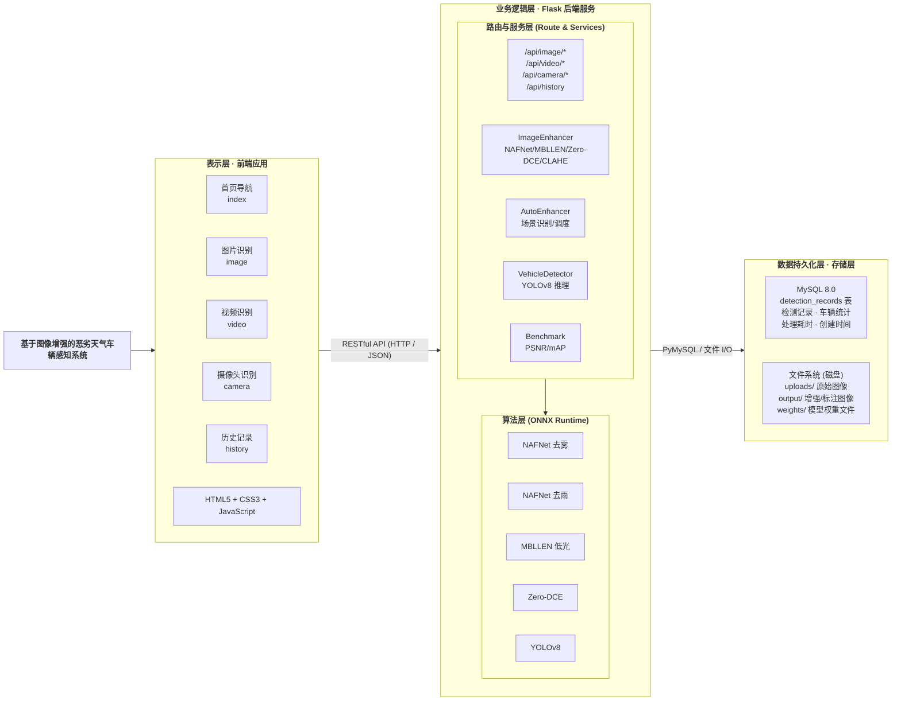
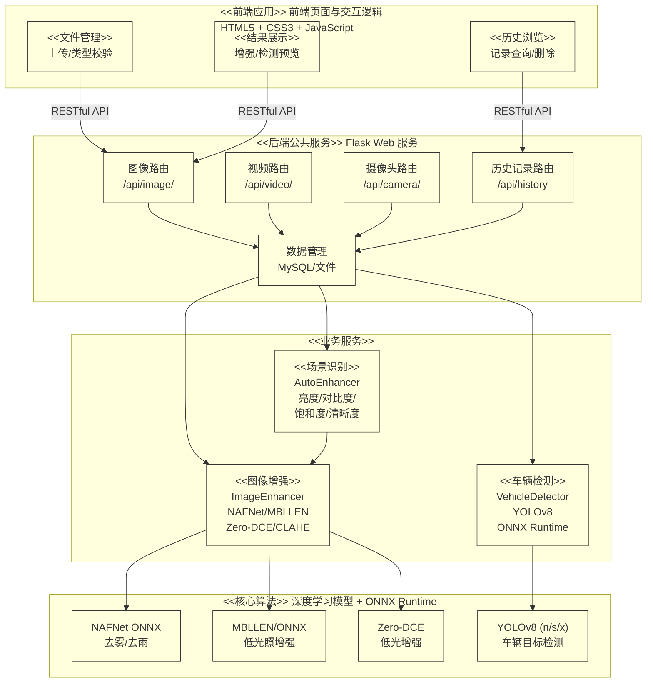
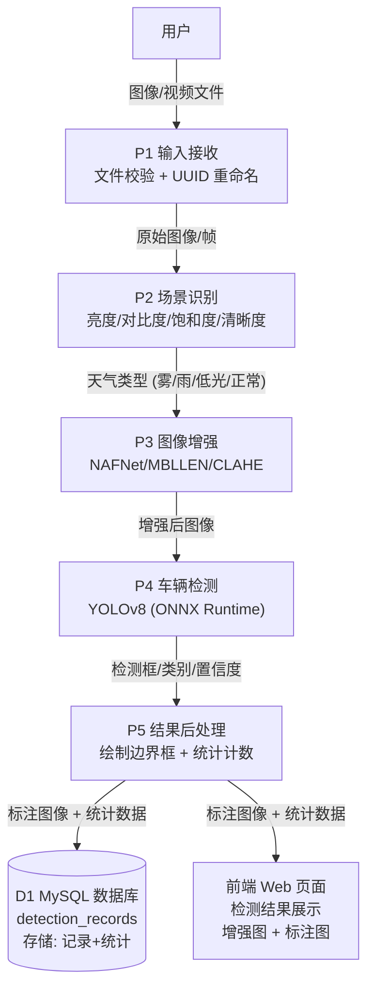
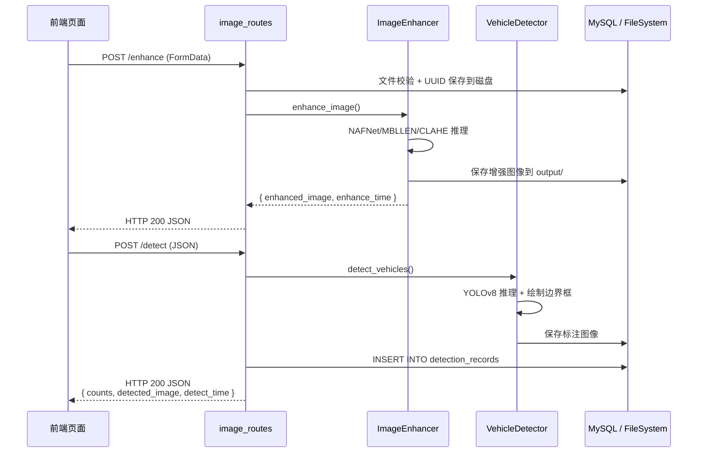
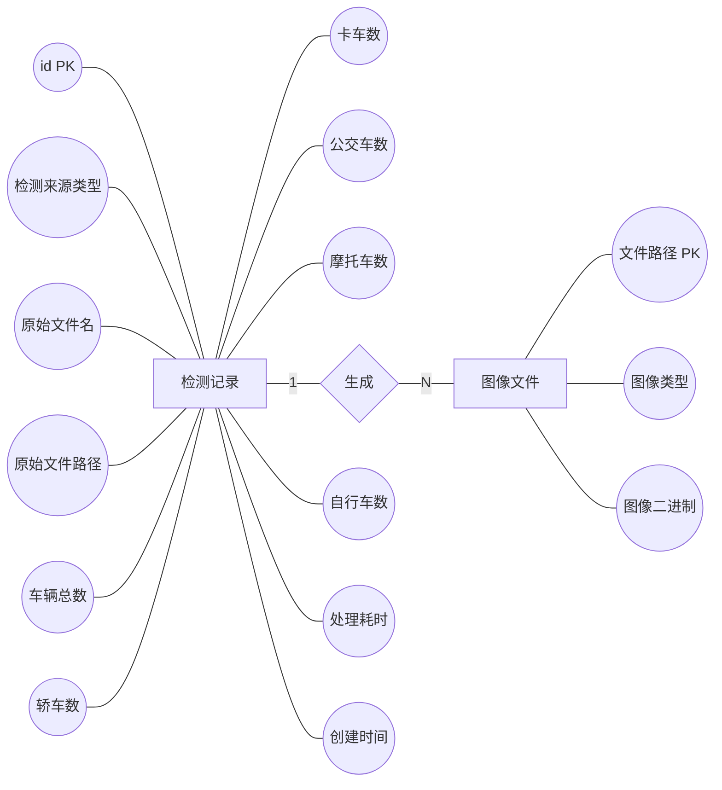
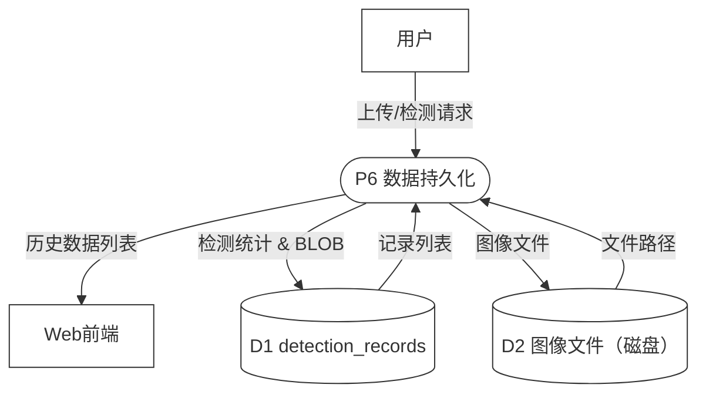
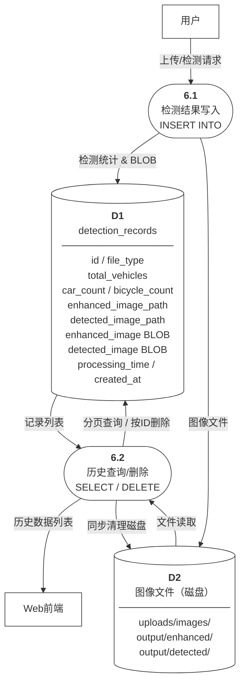

# 4 系统详细设计与实现

## 4.1 系统总体架构

本系统采用前后端分离 B/S 架构，分为前端界面、后端服务、数据存储三层。前端通过接口与后端交互。后端处理业务与算法运算。数据层存储数据与文件，架构低耦合容易拓展。

用户在前端上传文件或实时取景，数据经接口传入 Flask 后端，后端完成图像增强、车辆检测等核心处理。结果存入存储端并以数据形式回传前端展示。

系统数据流程图采用 Gane-Sarson 流派绘制，分为顶层数据流图和一层数据流图两层。顶层数据流图展示系统边界、外部实体交互及数据存储；一层数据流图对系统内部加工进行分解，详细展示处理流程与数据流转。两层图之间严格遵循父子平衡原则。

#### 4.1.0 顶层数据流图（Level-0）

顶层图将整个系统抽象为唯一的加工过程，展示系统与外部环境的数据交互关系及涉及的数据存储，如图 4-1所示（源文件：`图4-1_顶层数据流图.drawio`，可用 draw.io 打开编辑并导出为 PNG/PDF）：

**图4-1 顶层数据流图（Level-0）**

> 📎 draw.io 源文件：[图4-1_顶层数据流图.drawio](图4-1_顶层数据流图.drawio)

**说明：** 顶层图中系统被视为一个整体黑盒，外部有"用户"和"前端展示"两个实体与其交互。用户向系统输入待处理的图像或视频数据，前端向系统发送操作请求，系统经处理后向前端返回检测结果，同时将检测记录存入数据库、图像存入文件系统。

#### 4.1.1 一层数据流图（Level-1）

一层数据流图将顶层系统的黑盒分解为五个主要加工，详细展示数据在各加工间的流转及数据存储的读写操作，如图 4-2所示（源文件：`图4-2_一层数据流图.drawio`，可用 draw.io 打开编辑并导出为 PNG/PDF）：

**图4-2 一层数据流图（Level-1）**

> 📎 draw.io 源文件：[图4-2_一层数据流图.drawio](图4-2_一层数据流图.drawio)

**Gane-Sarson 元素规范：**

| 符号 | 形状 | 类型 | 出现层级 | 说明 |
|---|---|---|---|---|
| E1 / E2 | 矩形 | 外部实体 | Level-0 + Level-1 | 数据的源点或终点，位于系统边界之外 |
| S0 / 1~5 | 圆角矩形 | 加工（Process） | Level-0（1个）+ Level-1（5个） | 对数据进行加工或变换的操作，左侧标注编号 |
| D1 / D2 | 开口矩形 | 数据存储（Data Store） | Level-0 + Level-1 | 数据静态保存的位置，右侧开口表示 |
| → | 带箭头线 | 数据流（Data Flow） | 全部 | 数据在元素间的流动方向 |

**父子平衡验证：**

| 方向 | Level-0（父图） | Level-1（子图） | 是否一致 |
|---|---|---|---|
| 输入 | 用户 → 系统（图像/视频/帧数据） | 用户 → **1**（图像/视频/帧数据） | ✅ 一致 |
| 输入 | 前端 → 系统（请求指令） | 前端 → **5**（请求指令） | ✅ 一致 |
| 输出 | 系统 → 前端（检测结果 JSON） | **5** → 前端（检测结果 JSON） | ✅ 一致 |
| 输出 | 系统 → D1（检测记录） | **5** → D1（写入记录） | ✅ 一致 |
| 输出 | 系统 → D2（增强图像/标注图像） | **5** → D2（保存图像文件） | ✅ 一致 |

**各加工说明：**

| 编号 | 名称 | 输入数据 | 输出数据 | 功能描述 |
|---|---|---|---|---|
| **1** | 接收输入 | 图像/视频/帧数据 | 原始图像 | 接收用户上传文件或摄像头采集帧 |
| **2** | 场景识别 | 原始图像 | 天气类型 | 提取亮度/对比度/饱和度/清晰度四维特征，级联判断天气场景 |
| **3** | 图像增强 | 天气类型+原始图像 | 增强后图像 | 按场景调度 NAFNet/MBLLEN/Zero-DCE/CLAHE 等算法 |
| **4** | 车辆检测 | 增强后图像 | 检测框/类别/置信度 | YOLOv8 模型推理，输出车辆目标信息 |
| **5** | 结果封装 | 检测结果+请求指令 | JSON响应+持久化数据 | 写入数据库记录、保存图像文件、返回响应给前端 |

### 4.1.2 架构设计原则

本系统的架构设计遵循这样几个原则，一是分层架构，采用经典的三层架构模式，把系统分成前端表示层、后端业务逻辑层和数据持久化层，各层的职责都很明确，耦合度也比较低；二是前后端分离，前端和后端通过RESTful API来通信，前端负责用户交互和结果展示，后端负责处理业务逻辑、调用算法，这样能方便两者独立开发和部署；三是模块化设计，后端用模块化的方式来组织，把不同功能的处理逻辑都封装成独立的服务模块和路由模块，能提高代码的可维护性和可复用性；四是算法与业务解耦，把核心算法的实现和业务逻辑分离开来，算法模块会提供统一的调用接口，方便算法独立迭代和替换。

### 4.1.3 系统分层架构

系统的总体架构如图2-1所示，由上到下分为表示层、业务逻辑层和数据持久化层三个层次：



图2-1  系统总体架构图

**第一层：表示层（前端）**

表示层采用原生HTML5、CSS3和JavaScript实现单页面应用（SPA），通过Ajax异步请求与后端API进行数据交互。前端页面包含四大功能区域：图像上传区展示文件上传组件和上传预览；检测结果显示区展示增强前后的图像对比和检测标注结果；统计分析区以图表和数字形式展示各车辆类别的检测数量统计；历史记录区展示历史检测记录列表，支持详情查看和记录删除。前端通过fetch API调用后端RESTful接口，获取JSON格式的响应数据，动态更新页面内容。

**第二层：业务逻辑层（后端）**

业务逻辑层采用Python Flask框架实现，按照功能职责划分为三个子层：

（1）路由层（Routes）：负责HTTP请求的接收、参数解析和响应返回。包含图像处理路由（image_routes）、视频处理路由（video_routes）、摄像头管理路由（camera_routes）和历史记录路由（history_routes）四个模块。

（2）服务层（Services）：负责核心业务逻辑的处理。包含图像增强服务（ImageEnhancer）封装了所有增强算法的调用；自动增强服务（AutoEnhancer）封装了场景识别和自动增强调度逻辑；车辆检测服务（VehicleDetector）封装了YOLOv8模型的加载和推理逻辑。

（3）算法层（Algorithms）：负责底层算法实现和模型推理。基于ONNX Runtime进行模型加载和推理，调用预训练的NAFNet、MBLLEN等深度学习模型完成图像增强，调用YOLOv8模型完成目标检测。

**第三层：数据持久化层**

数据持久化层采用MySQL关系型数据库和文件系统混合存储方案。结构化数据（检测记录、摄像头配置等）存储在MySQL数据库中；非结构化数据（上传图像、增强结果、标注图像）以文件形式存储在服务器的文件系统中，数据库记录中保存文件的路径引用。

### 4.1.3 系统模块划分

系统可从宏观上划分为前端、后端公共支撑、核心算法三个顶层包，各包之间的依赖关系如下图 2-2所示：



图2-2  系统模块包图

从上图能看出来，这套系统是按分层架构来设计的，一共划分成了八个功能模块，一是Web前端模块，能提供用户操作界面，帮用户完成文件上传、图像预览、结果查看和历史记录管理；二是文件接收与管理模块，会接收用户上传的文件，做好格式校验和安全检测，还能统一管理文件的存储路径和访问地址；三是图像增强模块，这是系统的核心功能，集成了去雾、去雨、低光照提亮等相关算法，通过对应策略统一接口，能动态调用合适的增强工具；四是自动场景识别模块，会分析图像的亮度、对比度等相关指标，自动识别当前场景并匹配最适合的增强方案；五是车辆检测模块，依托YOLOv8完成目标识别，支持模型缓存和规格切换，还能输出车辆框坐标、类别、置信度以及数量统计；六是视频流处理模块，能支持视频解码和RTSP摄像头取流，逐帧做好增强和检测，再重新编码输出结果流；七是数据管理模块，负责连接MySQL数据库，做好数据的增删改查，管理好检测记录和摄像头配置；八是性能评测子系统，属于离线基准测试模块，能在标准数据集上算出mAP、PSNR、SSIM等相关指标，还能生成评测报告。

### 4.1.4 模块间交互关系

各模块之间的数据流和控制流关系可用如下方式描述：

用户通过Web前端上传图像，前端将图像文件以multipart/form-data格式发送至后端的图像上传API。后端的路由层接收请求后，将文件保存至文件系统，并调用服务层进行处理。服务层的自动场景识别模块首先对图像进行分析，判断天气条件类型。随后，图像增强模块根据识别结果或用户指定的增强类型，调用相应的增强算法对图像进行恢复处理。增强后的图像传入车辆检测模块，由YOLOv8模型执行目标检测，输出检测结果。最后，所有处理结果（包括原始图像、增强图像、标注图像、检测统计数据）通过数据管理模块持久化存储，并以JSON格式返回至前端展示。

在视频和摄像头模式下，处理流程类似，但增加了视频帧的解码和编码环节，并对每一帧重复执行增强和检测操作，最终合成结果视频返回给用户。

### 4.1.5 数据处理流程设计

系统核心数据处理流程的数据流图（DFD）如图4-3所示，展示了从用户输入到结果输出的完整数据传递过程：



             图4-3  系统数据处理流程图（DFD）
    
    表4-1  DFD 元素说明

┌────────┬─────────────────────────────────────┐
│  符号   │               含义                   │
├────────┼─────────────────────────────────────┤
│  P1-P5 │  处理过程，对应各处理步骤              │
│  D1    │  数据存储，即 MySQL 数据库             │
│  →     │  数据流方向，箭头上标注传递的数据内容    │
└────────┴─────────────────────────────────────┘

完整的数据处理流程划分成五个执行环节，与一层数据流图中的五个加工一一对应。一是接收输入（加工1），系统可通过网络请求接收用户上传的图像文件，也能借助视频解码工具读取本地视频文件与监控摄像头的实时画面帧数据；二是场景识别（加工2），识别模块从输入图像中提取亮度、对比度、饱和度和清晰度四维质量参数，按照级联决策规则判定对应的天气类型，包括正常、雾天、雨天和低光照四种场景；三是图像增强（加工3），系统根据场景识别结果自动调度适配的增强算法，雾天场景调用NAFNet去雾模块，雨天场景调用NAFNet去雨模块，低光照场景调用MBLLEN或Zero-DCE增强模块，正常场景则跳过增强步骤以节省运算资源；四是车辆检测（加工4），增强处理后的图像被送入YOLOv8检测模型进行推理，模型输出包含检测框坐标、车辆类别和置信度的完整检测结果；五是结果封装（加工5），该环节同时完成三项任务，将检测记录写入MySQL数据库的detection_records表，将增强图像与标注图像保存至文件系统，最后将所有结果统一封装为JSON响应通过网络返回前端页面完成展示。

## 4.2 前端设计与实现

### 4.2.1 页面结构设计

前端使用原生 HTML5+CSS3+JS 开发，无框架依赖，适配系统简单交互需求，部署便捷，充分调用 HTML5 与 CSS3 原生能力。

前端共六个页面：首页负责导航，图像 / 视频 / 摄像头页面实现对应检测功能，历史记录与测试结果页面展示数据。

页面采用统一深色主题，通过 CSS 变量构建样式体系，支持三色主题切换。用户设置本地持久化，视觉统一且无需额外加载样式文件

前端页面显示如下图 4-2所示：

 

**图** **4****-****5****首页界面**

### 4.2.2 图片识别模块

图片识别是前端核心模块，分为图像上传、图像增强、目标检测三流程。

用户选取图片后，前端读取预览并携带增强参数传至后端接口；后端处理后回传增强图片与耗时，支持去雾、去雨、暗光增强等多种优化模式。

随后前端提交图像与模型参数完成车辆检测。后端返回车型数量与标注图。页面展示五类车辆统计数据及总耗时。

页面采用三步流水线布局，分区展示原图、增强图与检测结果，搭配加载提示，操作直观清晰。

图片识别模块前端界面见下方图 4-3所示：

 

**图** **4****-****6****图片识别界面**

### 4.2.3 视频识别模块

视频识别界面和图片识别有着相近的运行思路，仅有处理载体换成了视频文件这一处不同，一是视频完成上传操作后，后台能够调用 OpenCV 工具完成视频逐帧的解码工作，还能对每一帧画面完成画质优化调整，再借助 VideoWriter 工具把优化完毕的画面重新整合编码，生成全新的成品视频，二就是目标检测环节依旧沿用逐帧运行的处理模式，而为了有效加快整体运行速率，还会启用间隔取帧的运行方式，每隔六帧画面仅做一次目标检测，其余画面直接用前一帧得出的检测数据，该种优化方式能维持整体检测流程的连贯状态，能缩减到原有六分之一的运算工作量，前端页面可依靠<video>标签呈现出原视频与经过优化处理后的成品视频，页面所展示出的统计数据为视频画面里出现过的车辆最高数量，并非把全部画面里的车辆数量逐一相加得出的总计数值。

视频识别模块前端界面见下方图 4-4所示：

 

**图** **4****-****7****视频识别界面**

### 4.2.4 摄像头实时识别模块

摄像头实时识别是系统的一个功能，前端使用WebRTC API中的navigator.mediaDevices.getUserMedia接口获取摄像头视频流，在页面的<video>元素中实时显示。检测逻辑采用定时轮询机制，每次隔1秒从视频流中截取一帧进行处理。

采集到的视频帧通过Canvas绘制后编码为JPEG格式的Base64字符串，随增强模式和模型参数一并发送至后端的/api/camera/detect接口。后端对帧进行增强和检测后返回检测统计数据。前端实时更新统计显示，实现接近实时的检测体验。

视频识别模块前端界面见下方图 4-6所示：

 

**图** **4****-****8****视像头识别界面**

### 4.2.5 历史记录模块

历史记录页以表格展示检测数据，支持分页浏览、单删、批量删除与一键清空。分页接口每次加载十条记录，表格涵盖文件信息、车辆数量、效果图及时间等内容。

点击缩略图可弹窗全屏预览增强图与检测图，删除操作同步清除数据库数据与本地文件，保障数据统一。

历史记录识别模块前端界面见下方图 4-7所示：

 

**图** **4****-****9****历史记录界面**

### 4.2.6 测试结果分析页面

测试结果页面是系统评测数据的展示窗口，页面加载时自动请求/api/benchmark/results获取评测数据。页面按场景（雾天、雨天、低光照、正常）分类展示各增强方法在大规模基准测试中的性能表现，包括mAP50、mAP50-95、PSNR、SSIM等关键指标。数据以表格形式呈现，使用颜色编码增强可读性：mAP提升以绿色标示，下降以红色标示；PSNR超过30dB以绿色显示，低于20dB以红色显示。这种可视化的对比分析使用户能够直观地评估不同增强策略的效果差异。

测试结果模块前端界面见下方图 4-8所示：


## 4.3 后端路由设计与实现

后端采用Flask框架的Blueprint（蓝图）机制组织路由，将不同功能的路由分散到独立的模块中。应用入口[app.py](file:///e:/Workspace/bishe-1/backend/app.py)负责创建Flask应用实例、加载配置、注册蓝图和启动服务。

四个 Blueprint 模块的划分及各自内部 API 端点的组织结构如图4-7所示：

```
                        ┌─────────────────────┐
                        │   Flask 应用入口      │
                        │   app.py             │
                        │   create_app()       │
                        └──────────┬──────────┘
                                   │ register_blueprint()
           ┌───────────────────────┼───────────────────────────┐
           │                       │                           │
           ▼                       ▼                           ▼
  ┌─────────────────┐  ┌─────────────────────┐  ┌─────────────────────┐
  │  image_bp        │  │  video_bp            │  │  camera_bp          │
  │  /api/image      │  │  /api/video          │  │  /api/camera        │
  ├─────────────────┤  ├─────────────────────┤  ├─────────────────────┤
  │ POST /enhance   │  │ POST /enhance        │  │ POST /detect        │
  │ · 上传文件        │  │ · 上传视频            │  │ · Base64 帧解码      │
  │ · 文件校验        │  │ · 逐帧增强            │  │ · 帧级增强           │
  │ · 调用增强服务     │  │ · 跳帧策略            │  │ · YOLO 检测         │
  │                 │  │ · VideoWriter 输出    │  │ · IoU 跟踪去重       │
  │ POST /detect    │  ├─────────────────────┤  │ · 自动清理旧文件      │
  │ · 调用检测服务    │  │ POST /detect         │  └─────────────────────┘
  │ · 绘制边界框      │  │ · 跳帧检测            │
  │ · 存入数据库      │  │ · IoU 跟踪统计        │         ┌─────────────────────┐
  │ · 返回统计数据    │  │ · 峰值车辆计数         │         │  history_bp         │
  └─────────────────┘  └─────────────────────┘         │  (无前缀)            │
                                                        ├─────────────────────┤
                                                        │ GET  /api/history   │
                                                        │ · 分页查询           │
                                                        │ · 15 列表格字段      │
                                                        │                     │
                                                        │ GET  /api/history/  │
                                                        │      <id>/image/    │
                                                        │      <type>         │
                                                        │ · BLOB 图片返回      │
                                                        │                     │
                                                        │ POST /api/history/  │
                                                        │      delete         │
                                                        │ · 批量删除           │
                                                        │ · 磁盘文件同步清理    │
                                                        │                     │
                                                        │ POST /api/history/  │
                                                        │      delete_all     │
                                                        │ · 清空全部记录        │
                                                        │                     │
                                                        │ GET  /api/benchmark/│
                                                        │      results        │
                                                        │ · CSV 评测数据返回    │
                                                        └─────────────────────┘

                    图4-7  后端 Blueprint 路由组织结构图
```

该路由组织遵循"一个 Blueprint 一组 URL 前缀"的映射规则，每个 Blueprint 内部按 HTTP 方法继续细分路由，形成了清晰的树状结构。

以图片识别为例，一次完整的后端请求处理时序如图4-8所示：



           图4-8  API 请求处理时序图（以图片识别为例）

各路由模块职责明确：[/api/image](file:///e:/Workspace/bishe-1/backend/routes/image_routes.py)路由负责图像的上传、增强和检测；[/api/video](file:///e:/Workspace/bishe-1/backend/routes/video_routes.py)路由负责视频文件的增强和检测；[/api/camera](file:///e:/Workspace/bishe-1/backend/routes/camera_routes.py)路由处理摄像头帧的实时检测；历史记录路由覆盖CRUD操作，同时提供benchmark评测数据的查询接口。

系统配置通过[Config](file:///e:/Workspace/bishe-1/backend/config.py)类统一管理，包含MySQL数据库连接参数、文件上传路径、允许的文件类型和最大文件大小限制。上传文件大小限制设置为100MB，既满足了视频文件上传的需求，又防止了恶意的大文件上传攻击。

### 4.3.1 图像处理路由

图像处理路由封装在image_routes.py中，提供两个核心API端点：

POST /api/image/enhance接收用户上传的图像文件和增强类型参数。路由首先进行文件类型校验，仅允许PNG、JPG、JPEG、BMP和WebP格式。通过校验的文件以UUID重命名保存在uploads/images/目录下，避免文件名冲突。随后调用ImageEnhancer服务执行图像增强，增强后的图像保存至output/enhanced/目录。API响应返回增强图像的访问路径和增强耗时。

POST /api/image/detect接收增强后的图像路径、YOLO 模型规格和原始文件名等参数。路由调用VehicleDetector服务对增强图像执行目标检测，在图像上绘制检测边界框和类别标签，保存标注图像至output/detected/目录。同时，将检测结果（包括各类别车辆计数、处理耗时）和图像二进制数据写入MySQL数据库，返回记录ID和统计数据。

### 4.3.2 视频处理路由

视频处理路由在[video_routes.py](file:///e:/Workspace/bishe-1/backend/routes/video_routes.py) 中实现，同样提供增强和检测两个端点。

视频增强路由`POST /api/video/enhance`接收视频文件，使用OpenCV的VideoCapture逐帧读取，对每帧调用do_enhance函数执行增强处理。为提升处理效率，采用跳帧策略——每隔一帧处理一次，未处理的帧直接复用上一帧的结果。增强后的帧通过VideoWriter重新编码输出。在编码器选择上，依次尝试avc1、H264和mp4v三种编码标签，确保兼容性。

视频检测路由`POST /api/video/detect`接收增强后的视频，同样采用跳帧策略，每6帧执行一次YOLO检测。检测结果通过基于IoU的简单跟踪算法进行帧间关联，避免同一车辆在连续帧中被重复计数。每个检测到的目标分配一个UUID作为唯一标识，当与上一帧中某个目标的IoU超过0.3时视为同一目标，否则分配新ID。最终统计结果以跟踪器中的独立目标数量为准，而非所有帧检测到的目标总数之和，这种统计方式更准确地反映了视频中实际出现的车辆数量。

### 4.3.3 摄像头实时检测路由

摄像头路由在[camera_routes.py](file:///e:/Workspace/bishe-1/backend/routes/camera_routes.py)中实现，`POST /api/camera/detect`端点接收前端传来的Base64编码帧。

路由首先解码Base64字符串为图像数组，然后根据增强类型参数进行帧级增强处理。增强后的帧送入YOLO模型进行检测，检测结果绘制在帧上并保存到磁盘。与视频检测类似，摄像头模式也采用基于IoU的目标跟踪机制避免重复计数，同时引入超时清理策略——当某个跟踪目标超过2秒未更新时自动移除，适应摄像头的实时流特性。

系统还包含自动清理机制`cleanup_old_camera_images`，当`output/detected/`目录中的摄像头检测结果超过50张时，自动删除最旧的文件，防止磁盘空间被无限占用。

## 4.4 数据库设计

### 4.4.1 数据库选型与连接管理

系统采用MySQL 8.0关系型数据库进行结构化数据的持久化存储，通过PyMySQL驱动进行数据库连接操作。数据库连接配置通过环境变量注入，默认值为localhost、端口3306、用户名root，数据库名称为bishe_vehicle。数据库初始化`init_database`函数在应用启动时自动执行，首先尝试创建数据库（如不存在），然后在数据库中创建核心数据表。

### 4.4.2 数据库E-R图

系统的核心业务实体为"检测记录"（detection_records 表），每一次检测对应一条数据库记录，记录了检测来源类型、车辆分类统计、图像路径与二进制数据、处理耗时等信息。与检测记录关联的图像文件（原始图像、增强结果、检测标注图）通过文件路径和 LONGBLOB 两种方式存储，可视为"图像文件"隐含实体。系统的完整数据库E-R图如图4-2所示：



                    图4-2  系统数据库E-R图

系统仅涉及两类数据库实体：检测记录是核心实体，代表一次完整的检测会话，从其内部属性可进一步区分 file_type（image/video/camera 三种检测模式）和车辆统计结果的五类计数字段。检测记录在实现层面采用 MySQL 单表结构存储，实体属性的定义由 detection_records 表承载，同时利用 enhanced_image 和 detected_image 两个 LONGBLOB 字段内嵌核心图像数据以保证数据的自包含性。图像文件为附属实体，与检测记录呈 1:N 关系，代表一次检测会话产出的原始、增强与标注三类图像在文件系统中的物理副本，该实体的 file_path 字段被 detection_records 表引用为 enhanced_image_path 和 detected_image_path。

### 4.4.3 数据库数据流图

检测数据在系统内的存储与查询流程采用 Gane-Sarson 流派绘制数据流图，分为顶层和一层两层。

#### 4.4.3.1 顶层数据流图（Level-0）

顶层图将数据持久化过程抽象为一个整体加工，展示与外部实体及数据存储的交互关系，如图4-3所示：



图4-3  数据库顶层数据流图（Level-0）

**说明：** 顶层图中数据持久化子系统被视为一个整体，外部有"用户"和"Web前端"两个实体。用户向系统发送上传与检测请求，系统将检测数据写入数据库和文件系统，并向前端返回历史数据列表。

#### 4.4.3.2 一层数据流图（Level-1）

一层图将顶层的"P6 数据持久化"分解为两个加工：检测结果写入（P6.1）和历史查询/删除（P6.2），如图4-4所示：



图4-4  数据库一层数据流图（Level-1）

**父子平衡验证：**

| 方向 | Level-0（父图） | Level-1（子图） | 是否一致 |
|---|---|---|---|
| 输入 | 用户 → P6（上传/检测请求） | 用户 → **6.1**（上传/检测请求） | ✅ 一致 |
| 输出 | P6 → 前端（历史数据列表） | **6.2** → 前端（历史数据列表） | ✅ 一致 |
| 输出 | P6 → D1（检测统计 & BLOB） | **6.1** → D1（检测统计 & BLOB） | ✅ 一致 |
| 输出 | P6 → D2（图像文件） | **6.1** → D2（图像文件） | ✅ 一致 |

**各加工说明：**

| 编号 | 名称 | 输入数据 | 输出数据 | 功能描述 |
|---|---|---|---|---|
| **6.1** | 检测结果写入 | 上传/检测请求 + 检测结果 | 数据库记录 + 图像文件 | 检测完成后将统计结果、BLOB 图像写入 D1，图像文件落盘至 D2 |
| **6.2** | 历史查询/删除 | 用户查询/删除请求 | 历史数据列表 | 从 D1 分页查询记录，删除时同步清理 D2 磁盘文件 |

数据流图包含两条主要路径：写入路径（6.1）在每次检测完成后由后端触发，将检测统计结果、图像二进制数据和文件路径一并写入 detection_records 表（D1），同时将图像文件落盘至 D2；查询路径（6.2）响应用户查看历史记录的操作，从 D1 中读取记录列表，支持按页查询和按 ID 删除，删除时同步清理 D2 中对应的磁盘文件。

### 4.4.3 数据库用例图

从各模块对数据库的操作视角分析，系统内不同组件对 detection_records 表的访问关系可用图4-3b表示：

```
                              ┌──────────────────────────────────┐
                              │          detection_records        │
                              │            (MySQL 8.0)            │
                              └───────┬────────┬────────┬─────────┘
                                      │        │        │
                  ┌───────────────────┘        │        └───────────────────┐
                  │                            │                            │
                  ▼                            ▼                            ▼
        ┌──────────────────┐       ┌──────────────────┐       ┌──────────────────┐
        │   <<image_routes>>│       │  <<history_routes>>│      │  <<camera_routes>>│
        │   /api/image/*    │       │   /api/history/*   │       │   /api/camera/*   │
        ├──────────────────┤       ├──────────────────┤       ├──────────────────┤
        │ UC-DB01           │       │ UC-DB02           │       │ UC-DB03           │
        │ 写入检测记录        │       │ 分页查询历史记录    │       │ 写入摄像头检测记录  │
        │ INSERT + BLOB     │       │ SELECT ... LIMIT   │       │ INSERT + BLOB     │
        ├──────────────────┤       ├──────────────────┤       └──────────────────┘
        │ UC-DB04           │       │ UC-DB05           │
        │ 更新文件路径        │       │ 按 ID 删除记录      │
        │ UPDATE ... SET    │       │ DELETE WHERE id    │
        └──────────────────┘       ├──────────────────┤
                                   │ UC-DB06           │
                                   │ 清空全部记录        │
                                   │ DELETE FROM       │
                                   └──────────────────┘

         ┌──────────────────┐
         │  <<video_routes>> │
         │   /api/video/*    │
         ├──────────────────┤
         │ UC-DB07           │
         │ 写入视频检测记录    │
         │ INSERT            │
         └──────────────────┘

               图4-3b  数据库用例图

     表4-2  数据库用例说明
┌─────────┬──────────────────┬────────────────┬──────────────────────────┐
│  用例ID  │     调用模块       │   SQL 操作       │         说明              │
├─────────┼──────────────────┼────────────────┼──────────────────────────┤
│ UC-DB01 │  image_routes    │ INSERT INTO    │ 图片检测完成时写入统计数据   │
│         │                  │ + LONGBLOB     │ 与图像二进制               │
│ UC-DB02 │  history_routes  │ SELECT ...     │ 按页查询，每页10条          │
│         │                  │ ORDER BY       │ 按 created_at 倒序         │
│ UC-DB03 │  camera_routes   │ INSERT INTO    │ 摄像头每帧检测结果入库       │
│         │                  │ + LONGBLOB     │                           │
│ UC-DB04 │  image_routes    │ UPDATE ... SET │ 增强/检测后更新对应的       │
│         │                  │                │ enhanced/detected 路径     │
│ UC-DB05 │  history_routes  │ DELETE WHERE   │ 单条/批量删除，同步清理     │
│         │                  │ id IN (...)    │ 磁盘文件                  │
│ UC-DB06 │  history_routes  │ DELETE FROM    │ 清空全表，同步清理所有      │
│         │                  │                │ 关联磁盘文件               │
│ UC-DB07 │  video_routes    │ INSERT INTO    │ 视频检测完成时写入峰值       │
│         │                  │                │ 车辆数及各类别统计          │
└─────────┴──────────────────┴────────────────┴──────────────────────────┘
```

数据库仅有一张核心表 detection_records，所有数据库操作都围绕该表展开。四个 Blueprint 模块中共产生七类数据库用例：image_routes 和 camera_routes 在每次检测完成后执行 INSERT 写入，都会同时存入图像二进制数据（LONGBLOB 类型）以保证数据的自包含性；video_routes 在视频检测结束后写入峰值车辆数和类别统计；history_routes 承担所有查询和删除操作，查询采用分页 SELECT 配合 ORDER BY created_at DESC 排序，删除操作在移除记录的同时同步清理磁盘上的图像文件。

### 4.4.4 数据表结构

核心数据表为`detection_records`，其表结构设计如下：

| 字段名 | 类型 | 说明 |
|--------|------|------|
| id | INT PRIMARY KEY AUTO_INCREMENT | 自增主键 |
| file_type | ENUM('image','video','camera') | 文件类型 |
| file_name | VARCHAR(255) | 原始文件名 |
| file_path | VARCHAR(500) | 文件存储路径 |
| total_vehicles | INT | 检测车辆总数 |
| car_count | INT | 轿车数量 |
| truck_count | INT | 卡车数量 |
| bus_count | INT | 公交车数量 |
| motorcycle_count | INT | 摩托车数量 |
| bicycle_count | INT | 自行车数量 |
| enhanced_image_path | VARCHAR(500) | 增强后图像路径 |
| detected_image_path | VARCHAR(500) | 标注后图像路径 |
| enhanced_image | LONGBLOB | 增强图像二进制数据 |
| detected_image | LONGBLOB | 标注图像二进制数据 |
| processing_time | FLOAT | 处理耗时（秒） |
| created_at | TIMESTAMP | 创建时间 |

各车辆类别计数字段分别记录五种车辆的检测数量，方便后续的统计查询和前端展示。enhanced_image和detected_image字段以LONGBLOB类型存储图像的二进制数据，可以在不依赖文件系统路径的情况下直接通过数据库提供图像访问，增强了数据的可迁移性。

### 4.4.5 数据库操作封装

数据库操作通过上下文管理器封装，确保连接的自动释放。

这种封装方式使得数据库操作代码简洁且安全，无论操作过程中是否发生异常，连接都能正确关闭，避免了连接泄漏问题。

```python
@contextmanager
def get_db_connection():
    conn = pymysql.connect(**DB_CONFIG)
    try:
        yield conn
    finally:
        conn.close()
```

## 4.5 视频流处理方案

视频和摄像头模式是系统的重要输入方式，其核心挑战在于如何在有限的计算资源下实现流畅的实时处理。

视频处理管线包括以下环节：视频解码（OpenCV VideoCapture）→ 帧级增强（支持多种增强方法）→ 帧级检测（YOLOv8）→ 检测结果绘制 → 视频编码（OpenCV VideoWriter）。

为提升处理速度，系统在视频和摄像头模式中均采用了跳帧策略。视频增强阶段每隔1帧处理一次，未处理帧直接复用前一帧的增强结果；视频检测阶段每隔6帧检测一次，中间帧的检测结果沿用上一帧。摄像头模式中，采集间隔设置为1秒，避免了对每帧都进行处理的性能开销。这些优化策略在保证检测效果基本一致的前提下，大幅降低了计算负载。

视频编码器选择方面，系统使用OpenCV的VideoWriter_fourcc尝试多种编码标签，按avc1、H264、mp4v的优先级顺序依次尝试，直到找到系统支持的编码器。这种容错机制确保了在不同操作系统和OpenCV版本下的兼容性。

## 4.6 图像增强服务的多模型管理

图像增强服务（ImageEnhancer）采用单例模式和惰性加载相结合的设计，统一管理多个增强模型的加载与调用。

单例模式通过重写`__new__`方法和`_initialized`类变量控制实例化行为，确保全局只有一个增强器实例。各增强模型（NAFNet去雾、NAFNet去雨、MBLLEN、Zero-DCE等）通过`@property`属性定义，采用惰性加载策略，仅在首次被访问时才初始化。这种设计避免了在系统启动阶段加载所有模型，显著降低了系统启动时间和内存占用。

增强方法的调度通过策略分发字典实现，`enhance_image`方法根据enhancement_type参数动态选择对应的处理函数。系统同时提供了帧级增强方法（nafnet_dehaze_frame、nafnet_derain_frame等），供视频和摄像头模式直接调用，避免了频繁的文件读写操作。

## 4.7 系统安全性设计

系统在设计和实现中考虑了基本的安全性措施。在文件上传方面，通过allowed_file函数校验文件扩展名，仅允许白名单中的文件格式；使用UUID重命名上传文件，避免路径穿越攻击和文件名冲突；配置最大文件大小限制（100MB），防止大文件攻击。在数据库操作方面，使用参数化查询（%s占位符）而非字符串拼接，有效防止SQL注入攻击。在错误处理方面，设计了全局异常处理器，防止敏感信息泄露到响应中。
